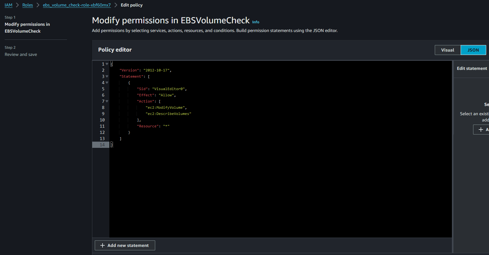
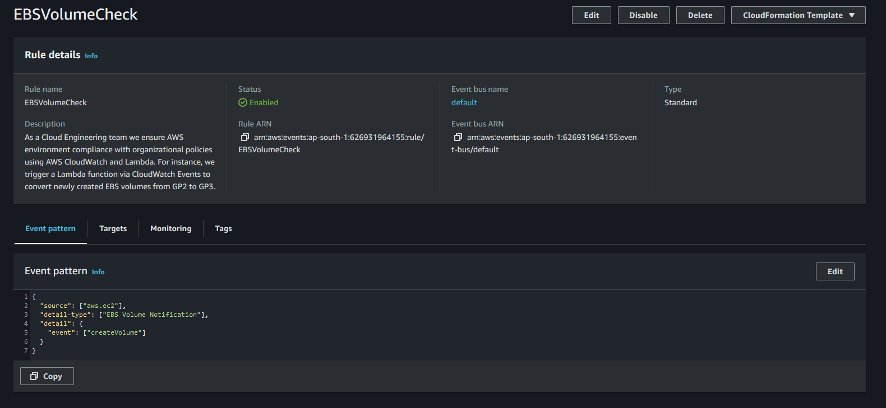
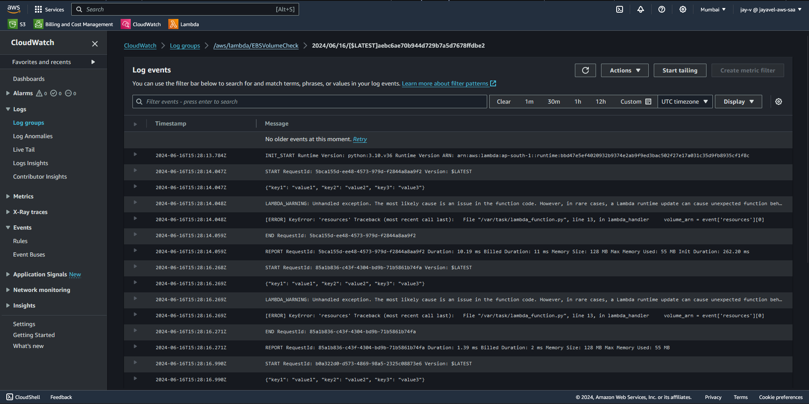

# AutoEBSOptimizer: Real-time Compliance for AWS EBS Volumes

## Overview

This project automates the conversion of newly created Amazon Elastic Block Store (EBS) volumes from `gp2` type to `gp3` type using AWS Lambda and CloudWatch Events. When an EBS volume is created, a CloudWatch Event triggers a Lambda function, which then modifies the volume type to `gp3`.

## Architecture

### Components:

- **EBS Volume Creation Event:** AWS service event that triggers when a new EBS volume is created.
- **CloudWatch Event Rule:** Monitors for EBS volume creation events (`CreateVolume` API calls) and triggers the Lambda function.
- **Lambda Function:** Receives the event, extracts the volume ID from the ARN, and modifies the volume type using the AWS SDK (`boto3`).
- **IAM Role:** Assigned to the Lambda function with permissions (`ec2:ModifyVolume`) to modify EBS volumes.
- **Logging:** CloudWatch Logs for monitoring Lambda function execution and API responses.

## Setup

### Prerequisites

- AWS Account with appropriate permissions to create Lambda functions, CloudWatch Event rules, and modify IAM roles.
- AWS CLI configured with appropriate credentials or IAM role attached to your development environment.

### Deployment Steps

1. **Create Lambda Function:**
   - Use AWS Management Console, AWS CLI, or AWS SDKs to create a Lambda function.
   - Ensure the function has an IAM role with `ec2:ModifyVolume` permission.
  
     

2. **Set Up CloudWatch Event Rule:**
   - Create a CloudWatch Event Rule to trigger the Lambda function on EBS volume creation events (`CreateVolume` API calls).
  
     

3. **Lambda Function Code:**
   - Use the provided Lambda function code (`lambda_function.py`) in your Lambda function.
   - Customize as per your environment (e.g., error handling, logging).
  
     
     

4. **Configure CloudWatch Logs:**
   - Ensure that the Lambda function is configured to send logs to CloudWatch Logs.
   - Monitor the logs for debugging and tracking the function's execution and any errors that may occur.
  
     

5. **Testing:**
   - Test the setup by creating new EBS volumes in your AWS environment and verifying if they are automatically converted from `gp2` to `gp3`.
   - Ensure that volumes of type `gp3` are not modified.

     
     

## Usage

Once deployed, the system will automatically convert any newly created EBS volumes from `gp2` to `gp3` type. Monitor CloudWatch Logs for Lambda function executions and API responses for auditing and troubleshooting.

